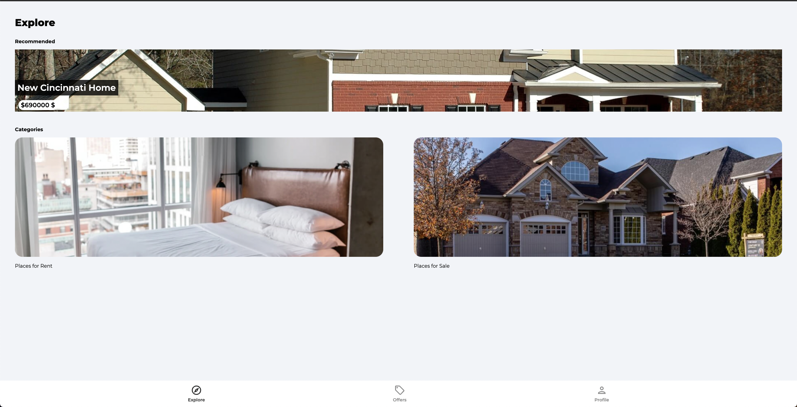
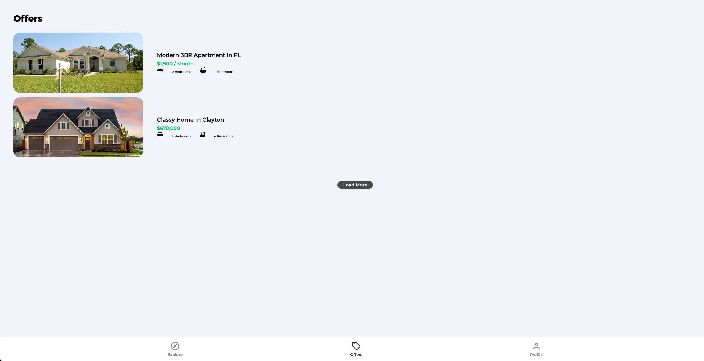
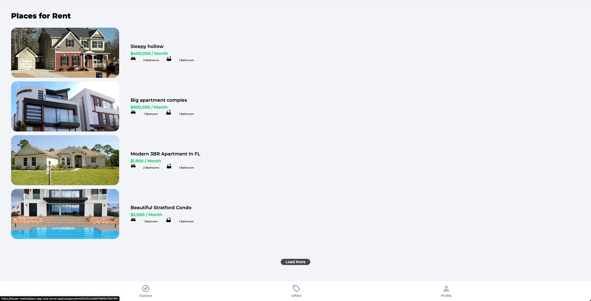
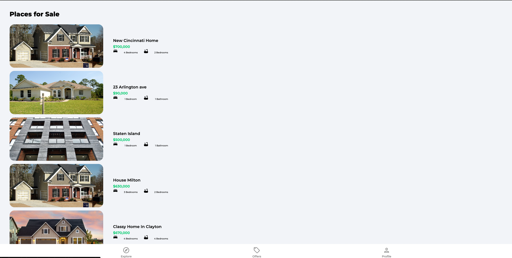
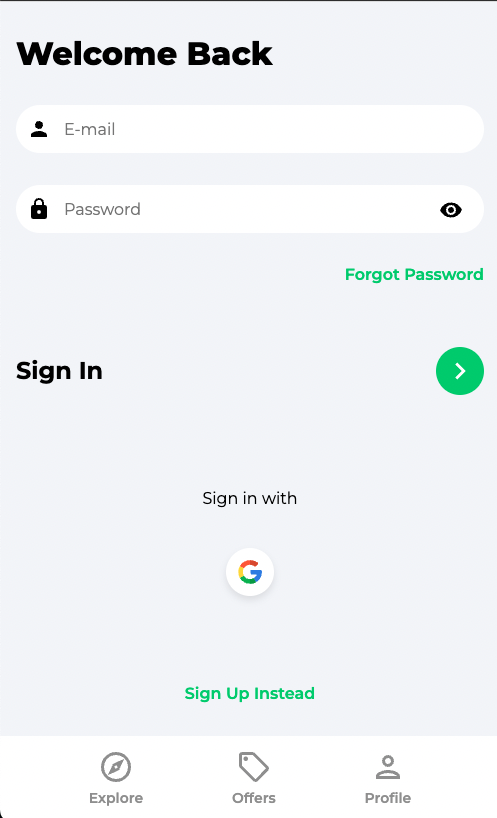
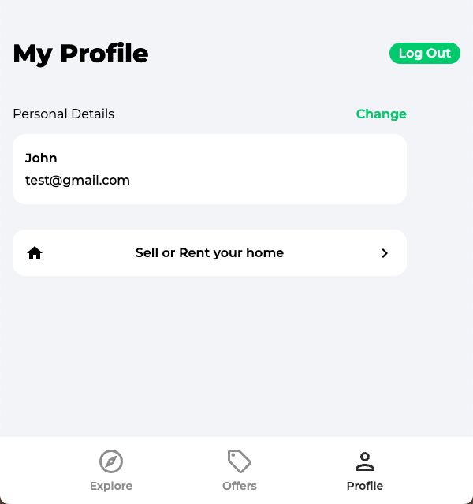
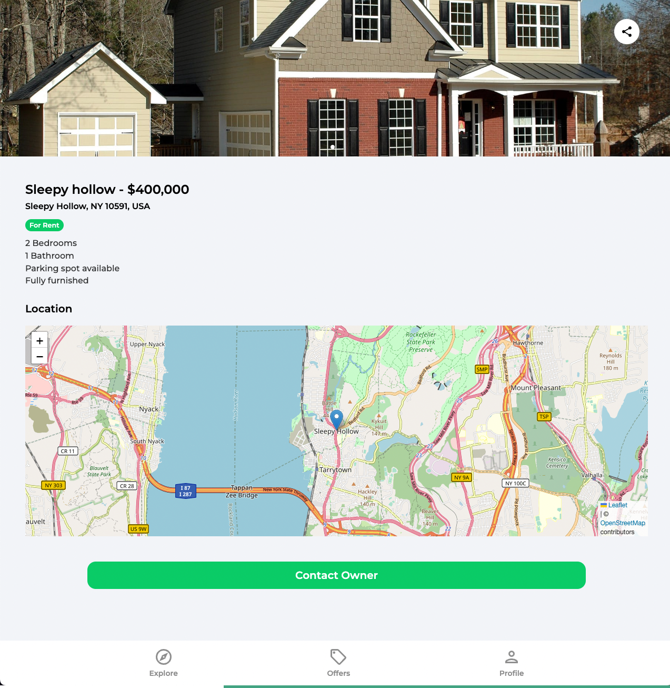

# Live URL for project
https://house-marketplace-app-iota.vercel.app/

## Project Overview
This MERN house marketplace focuses on creating, displaying and authenticating data using tools such as MongoDB, REST API, Firebase and Geocoding API/Leaflet.

## Project Snapshots

### Home/Explore

### Offers

### Rent

### Sale

### Sign-in

### Profile

### Listing

### Create Listing

## Available Scripts
### `npm start`

Runs the app in the development mode.\
Open [http://localhost:3000](http://localhost:3000) to view it in your browser.
